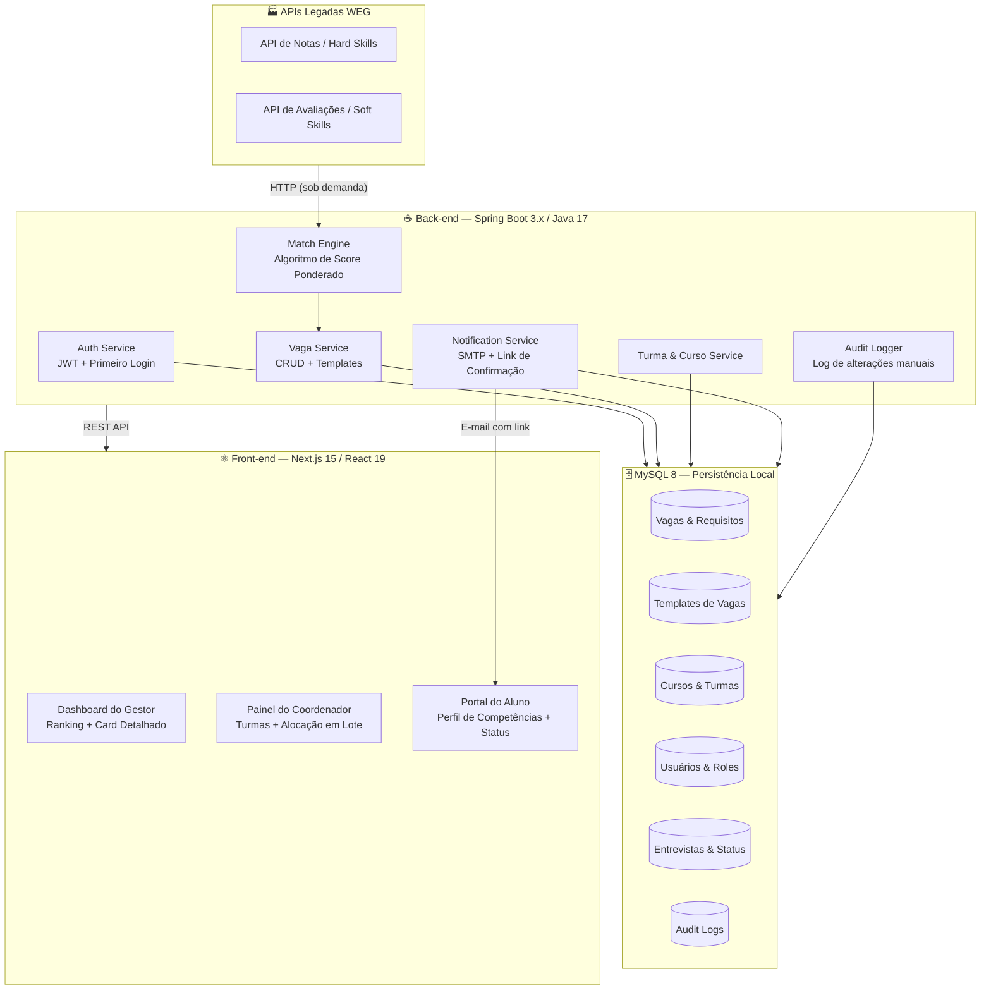

# ⚡ Quick-transfer — Alocação Inteligente de Aprendizes na WEG

> **Plataforma corporativa que substitui o processo manual de alocação de aprendizes por um fluxo auditável e orientado a dados**, calculando compatibilidade candidato–vaga em tempo real ao consumir notas e avaliações diretamente das APIs legadas da WEG — sem duplicação de dados, sem subjetividade não rastreável.

---

## O Problema vs. A Solução

### 🔴 O Cenário Anterior

O processo de alocação de aprendizes na WEG era conduzido manualmente por coordenadores e gestores, resultando em:

| Dor Operacional | Impacto |
|---|---|
| Planilhas descentralizadas de notas e habilidades | Dados desatualizados e inconsistentes entre áreas |
| Seleção subjetiva sem critérios padronizados | Risco de conformidade e falta de equidade |
| Ausência de histórico de decisões | Zero auditoria em casos de contestação |
| Comunicação manual de entrevistas | Alto índice de falhas e retrabalho do RH |
| Sem visibilidade consolidada de vagas e turmas | Coordenadores operando no escuro |

### 🟢 A Solução Quick-transfer

O Quick-transfer centraliza e automatiza o ciclo completo de alocação:

1. **Integração não-invasiva**: Consome notas de hard skills e soft skills diretamente das **APIs legadas da WEG**, sem replicar dados sensíveis no banco local.
2. **Score contínuo de compatibilidade (0–100)**: Calculado pelo Algoritmo de Match Ponderado, com base nos pesos definidos pelos próprios gestores para cada vaga.
3. **Ranking auditável**: Todas as intervenções manuais de coordenadores e gestores são persistidas com log de alterações.
4. **Fluxo de entrevista rastreável**: Confirmações de candidatos via link de e-mail atualizam o status automaticamente no sistema.

---

## Arquitetura do Sistema

### Diagrama Conceitual



## Matriz de Funcionalidades

### 👔 Gestor

| Funcionalidade | Descrição | Restrições |
|---|---|---|
| **Criar Vaga** | Define nome, descrição, local, setor, turno, nº de vagas, requisitos (0–10) e flag PcD | — |
| **Editar Vaga** | Atualiza campos da vaga após criação | ⚠️ Quantidade de vagas **não pode ser alterada** após criação |
| **Templates de Requisitos** | Salva configurações de pesos de uma vaga como modelo reutilizável | Quantidade de vagas é excluída do template |
| **Visualizar Ranking** | Lista aprendizes aplicados ordenados por score de compatibilidade (desc) | — |
| **Abrir Card do Aluno** | Visualiza perfil detalhado de competências do candidato | — |
| **Marcar Entrevista** | Preenche local, data e hora; nome do gestor é preenchido automaticamente | — |
| **Fechar Vaga** | Encerra o processo seletivo da vaga | Só disponível ao atingir a quantidade mínima de candidatos selecionados |

---

### 🗂️ Coordenador

| Funcionalidade | Descrição | Restrições |
|---|---|---|
| **Criar Curso** | Cadastra novo curso com Nome e Cor do Card | — |
| **Listar Cursos** | Visualiza todos os cursos cadastrados | — |
| **Criar Turma** | Cria turma com sigla, data de início e término | Vínculo com um **curso é obrigatório** |
| **Adicionar Alunos à Turma** | Associa alunos existentes no sistema à turma | — |
| **Listar Vagas Disponíveis** | Visualiza vagas abertas no sistema | — |
| **Ver Turmas Recomendadas** | Turmas ordenadas por **proximidade de término de curso** | — |
| **Aplicar Aluno Individual** | Inscreve um aprendiz específico em uma vaga | Alunos exibidos por ranking de aptidão |
| **Aplicar Turma em Lote** | Inscreve todos os alunos de uma turma em uma vaga de uma só vez | — |

---

### 🎓 Aluno

| Funcionalidade | Descrição | Restrições |
|---|---|---|
| **Dashboard de Competências** | Visualiza seu perfil completo (hard & soft skills) consumido via API WEG | Dados são read-only; originam-se do sistema legado |
| **Confirmação de Entrevista** | Recebe e-mail com link; ao clicar, status da entrevista é alterado para **"Visualizado"** no sistema | Ação é unidirecional via link tokenizado |

---

### 🔐 Autenticação (Todos os Perfis)

| Funcionalidade | Descrição |
|---|---|
| **Primeiro Login** | Força redefinição de senha; nova senha é persistida localmente no MySQL |
| **Controle de Acesso por Papel** | Acesso restrito por role: `GESTOR`, `COORDENADOR`, `ALUNO` |

---

## Estratégia de Integração e Persistência

### O que roda sob demanda (APIs WEG — sem persistência local)

| Dado | Origem | Frequência |
|---|---|---|
| Notas de hard skills do aprendiz | API legada WEG | A cada cálculo de score / visualização de card |
| Avaliações de soft skills | API legada WEG | A cada cálculo de score / visualização de card |
| Perfil de competências (Dashboard do Aluno) | API legada WEG | A cada acesso ao dashboard |

> **Princípio**: o Quick-transfer nunca replica dados acadêmicos no banco local. Isso garante que o score sempre reflita a nota mais recente da WEG e elimina o risco de inconsistência.

### O que é persistido no MySQL local

| Entidade | Justificativa |
|---|---|
| **Vagas** (+ requisitos e pesos) | Definidas pelo gestor; não existem no sistema legado |
| **Templates de Vagas** | Artefatos internos do Quick-transfer |
| **Cursos** | Cadastros criados pelo coordenador |
| **Turmas** (+ alunos associados) | Estrutura organizacional do Quick-transfer |
| **Usuários e Roles** | Controle de acesso local; senhas (hash) após primeiro login |
| **Entrevistas** (local, data/hora, status) | Estado rastreável do processo seletivo |
| **Audit Logs** | Registro imutável de toda intervenção manual no ranking ou nas vagas |

---

## Guia de Setup Realista

### Pré-requisitos

- Java 17+
- Maven 3.9+
- Node.js 20+ / npm ou pnpm
- MySQL 8 (instância local ou container Docker)
- Acesso às APIs legadas WEG (credenciais e endpoints fornecidos pelo time de integração)

---

### Back-end — Spring Boot 3.x

#### 1. Configurar variáveis de ambiente

Crie um arquivo `.env` ou configure as propriedades no `application.yml`:

```yaml
# application.yml
spring:
  datasource:
    url: jdbc:mysql://${DB_HOST:localhost}:${DB_PORT:3306}/${DB_NAME:quicktransfer}
    username: ${DB_USER}
    password: ${DB_PASSWORD}
  jpa:
    hibernate:
      ddl-auto: validate
    show-sql: false

# Integração WEG
weg:
  api:
    base-url: ${WEG_API_BASE_URL}
    client-id: ${WEG_API_CLIENT_ID}
    client-secret: ${WEG_API_CLIENT_SECRET}

# SMTP para e-mails de entrevista
spring:
  mail:
    host: ${SMTP_HOST}
    port: ${SMTP_PORT:587}
    username: ${SMTP_USER}
    password: ${SMTP_PASSWORD}
    properties:
      mail.smtp.auth: true
      mail.smtp.starttls.enable: true

# URL base do front-end (usada nos links de confirmação de entrevista)
app:
  frontend-base-url: ${FRONTEND_BASE_URL:http://localhost:3000}
  jwt:
    secret: ${JWT_SECRET}
    expiration-ms: ${JWT_EXPIRATION_MS:86400000}
```

#### 2. Variáveis de ambiente obrigatórias

| Variável | Descrição |
|---|---|
| `DB_HOST` | Host do MySQL |
| `DB_PORT` | Porta do MySQL (padrão: 3306) |
| `DB_NAME` | Nome do banco de dados |
| `DB_USER` | Usuário do banco |
| `DB_PASSWORD` | Senha do banco |
| `WEG_API_BASE_URL` | URL base das APIs legadas WEG |
| `WEG_API_CLIENT_ID` | Client ID para autenticação na API WEG |
| `WEG_API_CLIENT_SECRET` | Client Secret para autenticação na API WEG |
| `SMTP_HOST` | Servidor SMTP para envio de e-mails |
| `SMTP_PORT` | Porta SMTP (padrão: 587) |
| `SMTP_USER` | Usuário SMTP |
| `SMTP_PASSWORD` | Senha SMTP |
| `JWT_SECRET` | Chave secreta para assinatura dos tokens JWT |
| `FRONTEND_BASE_URL` | URL do front-end (para links de confirmação de entrevista) |

#### 3. Build e execução

```bash
# Clonar e acessar o diretório do back-end
cd backend

# Build
./mvnw clean package -DskipTests

# Executar
java -jar target/quick-transfer-*.jar
```

> O servidor sobe na porta `8080` por padrão. Ajuste via `SERVER_PORT`.

---

### Front-end — Next.js 15

#### 1. Configurar variáveis de ambiente

Crie o arquivo `.env.local` na raiz do projeto front-end:

```env
# .env.local

# URL da API do back-end Spring Boot
NEXT_PUBLIC_API_BASE_URL=http://localhost:8080/api

# (Opcional) Ambiente
NODE_ENV=development
```

#### 2. Instalação e execução em desenvolvimento

```bash
# Acessar o diretório do front-end
cd frontend

# Instalar dependências
npm install

# Iniciar servidor de desenvolvimento (porta 3000)
npm run dev
```

#### 3. Stack do front-end

| Tecnologia | Versão | Papel |
|---|---|---|
| Next.js | 15.x | Framework React com SSR/RSC |
| React | 19.x | Biblioteca de UI |
| TypeScript | 5.x | Tipagem estática |
| Tailwind CSS | v4 | Estilização utilitária |

---

## Stack Completa

| Camada | Tecnologia |
|---|---|
| Front-end | Next.js 15, React 19, TypeScript, Tailwind CSS v4 |
| Back-end | Spring Boot 3.x, Java 17, Spring Data JPA |
| Banco de Dados | MySQL 8 |
| Autenticação | JWT (Spring Security) |
| Comunicação com APIs WEG | HTTP Client (Spring WebClient) |
| Envio de E-mail | Spring Mail (SMTP) |

---

<div align="center">
  <sub>Quick-transfer · Desenvolvido para a WEG S.A.</sub>
</div>
